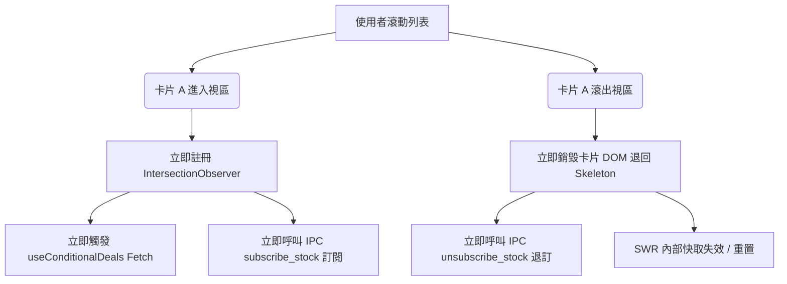
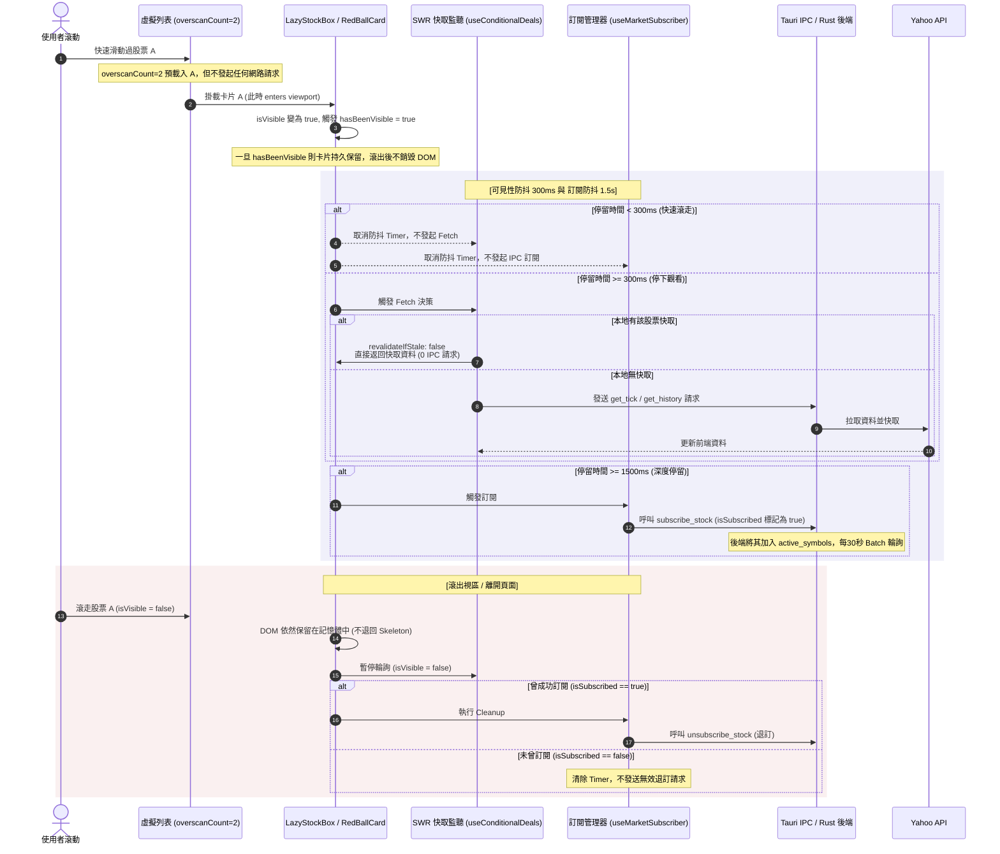

# 自選股與推薦股清單：滾動效能優化與請求降噪架構文件

本文件詳細紀錄了 SLstening 應用程式中「選股清單列表」（自選股清單、系統推薦股清單）在滾動時進行的效能調優與請求降噪架構。這項優化解決了在大量股票列表滾動時，因元件反覆銷毀重掛載、無效訂閱、與 SWR 重新驗證所引發的 CPU 掉幀與 Tauri IPC 請求風暴。

---

## 1. 優化前的架構瓶頸 (Before Optimization)

在優化之前，選股列表雖然使用了虛擬化列表（`react-window`），但在細節實作上存在以下效能漏洞：



### 🔴 核心痛點：
1. **元件銷毀重構風暴**：滾出視區的卡片立即被 `Unmount` 並替換為 Skeleton，滾回時又重新 `Mount`。這導致嚴重的 DOM 重排與重繪。
2. **IPC 與網路請求風暴**：快速滾動時，所有經過的股票卡片都在毫秒級時間內發送 `Fetch` 和 `Subscribe` 請求，隨後又立即發送 `Unsubscribe`，造成 Tauri IPC 信道嚴重堵塞。
3. **無效日 K 線輪詢**：日 K 線在盤中幾乎是靜態的，但每 20 秒仍會對畫面上所有卡片進行日 K 輪詢。
4. **動畫渲染開銷**：`Framer Motion` 在大列表元件頻繁掛載時，會帶來極高負載的 Javascript 運算，造成滾動卡頓。

---

## 2. 優化後的架構設計 (After Optimization)

為了解決上述痛點，我們在「組件生命週期」、「事件防抖」、「SWR 快取」與「後端訂閱」四個維度重新設計了流程。

### 2.1 整體請求與事件流架構圖



---

## 3. 核心優化模組與邏輯配置

### 🛠️ 模組一：`hasBeenVisible` 狀態持久化 (前端 DOM 降噪)
* **實現檔案**：`LazyStockBox.tsx`、`RedBallCard.tsx`
* **邏輯**：
  ```typescript
  const [hasBeenVisible, setHasBeenVisible] = useState(false);
  useEffect(() => {
    if (isVisible) setHasBeenVisible(true);
  }, [isVisible]);
  ```
  在渲染層，判斷改為 `!hasBeenVisible` 顯示 Skeleton。這意味著：
  - 卡片**只要亮過一次，就永遠渲染實體內容**。
  - 當卡片滾出視區時，它依然在虛擬列表的 DOM 中，只是透過 props 將 `isVisible: false` 傳給內部的請求 Hook。這在不觸發 DOM 重構的同時，成功停止了網路請求。

### 🛠️ 模組二：可見性防抖 (SWR 請求降噪)
* **實現檔案**：`useConditionalDeals.ts`
* **邏輯**：
  ```typescript
  const [debouncedIsVisible, setDebouncedIsVisible] = useState(false);
  useEffect(() => {
    if (!isVisible) {
      setDebouncedIsVisible(false);
      return;
    }
    const handler = setTimeout(() => {
      setDebouncedIsVisible(true);
    }, 300); // 300ms 防抖時間
    return () => clearTimeout(handler);
  }, [isVisible]);
  ```
  將 SWR 的觸發條件（`shouldFetch`）改為綁定 `debouncedIsVisible`。

### 🛠️ 模組三：SWR 快取策略調優 (快取複用最大化)
* **實現檔案**：`useConditionalDeals.ts`
* **邏輯**：
  - **歷史日 K 線 (`historyData`)**：
    - 將 `revalidateIfStale` 設為 `false`。掛載時若快取存在，絕不發送新請求。
    - 將 `refreshInterval` 設為 `0`（關閉盤中歷史數據輪詢）。
    - 將 `dedupingInterval` 設為 `300000` (5 分鐘)，保證在此期間不會產生任何無意義的日 K 請求。
  - **即時 Tick 資料 (`tickDeals`)**：
    - 將 `revalidateIfStale` 設為 `false`。
    - 將 `dedupingInterval` 設為 `15000` (15 秒)。
    - 將開盤輪詢頻率 `refreshInterval` 控制在 `20000` (20 秒)。

### 🛠️ 模組四：訂閱安全防抖 (後端 IPC 降噪)
* **實現檔案**：`useMarketSubscriber.ts`
* **邏輯**：
  引入 `isSubscribed` 狀態，限制僅在成功觸發訂閱後才發送退訂：
  ```typescript
  useEffect(() => {
    const shouldSubscribe = enabled && isVisible;
    if (shouldSubscribe) {
      let isSubscribed = false;
      const timer = setTimeout(() => {
        isSubscribed = true;
        invoke("subscribe_stock", { symbol: id });
      }, 1500); // 1.5 秒深度停留防抖

      return () => {
        clearTimeout(timer);
        if (isSubscribed) {
          invoke("unsubscribe_stock", { symbol: id });
        }
      };
    }
  }, [id, enabled, isVisible]);
  ```

---

## 4. 效能提升成效總結

1. **零白屏且零無效開銷**：
   `overscanCount={2}` 預載了邊界外的卡片，但在 300ms 可見性防抖的防護下，這部分預載卡片**不會發起任何 Fetch 或 IPC 訂閱**，成功達成「平滑滾動」與「零開銷」的雙重目標。
2. **消滅請求風暴**：
   快速滾動列表時，控制台保持完全靜態，不發送任何 API 與 IPC 訂閱請求。
3. **CPU 佔用顯著降低**：
   移除大列表切換時的 Framer Motion 動畫，改為 Vanilla CSS 切換，滾動時的掉幀次數降為 0，實現原生般流暢。
